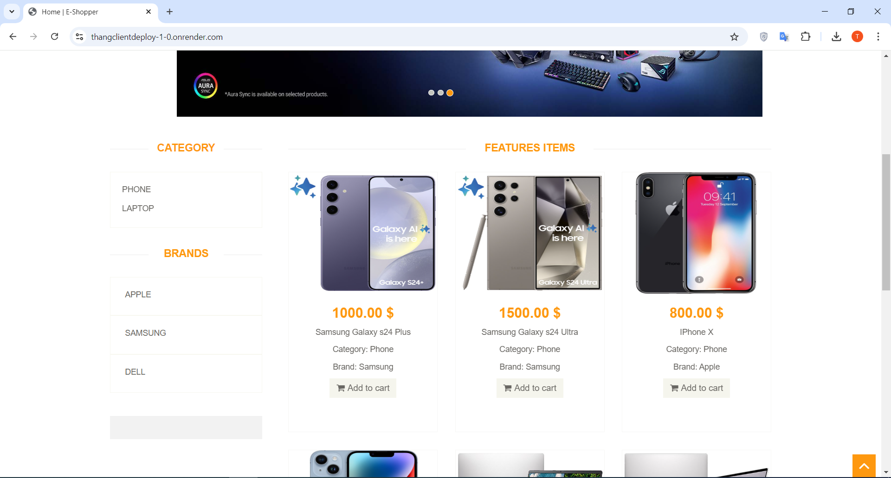
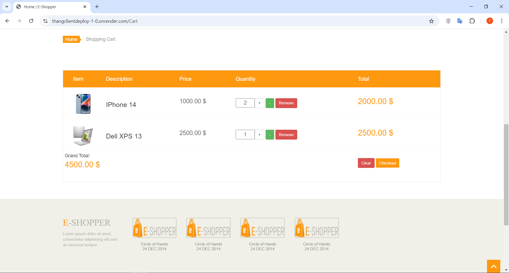
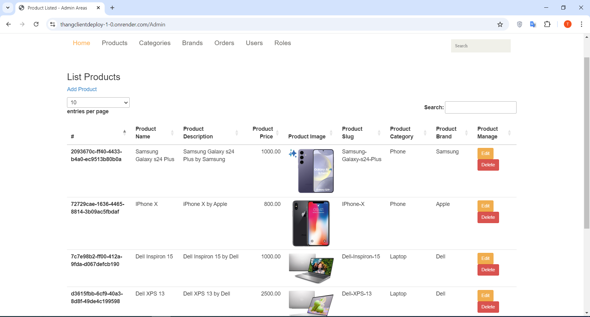

# Mock Project Shopping Store

**Topic**: E-commerce shopping store website

**Technologies used**:

- Identity Provider Server: Duende Identity, SQLite, EntityFramework Core
- API: ASP.Net Core Web API, SQLite, EntityFramework Core
- Client: ASP.Net Core MVC
- For deployment hosting (you can find it in the deployment branch), I changed SQLite to Postgres SQL, Cloudinary for image, Docker, and Render.com for deploying.

## Description

- This is the e-commerce website where customers can find and buy products they want online via the internet.
- We have 2 roles in the system: Admin and User<br/>
    Admin: they can manage the product, order, and user in the system by using the admin page.<br/>
    User: they can search, find products, add to a cart, and place orders.
- There are still many features that can be implemented in the future but we already have the basic functionality for an e-commerce website.
- Demo account (for both local project and hosting website) <br/>
  Admin: admin - pwd: 123456 <br/>
  User: user1 - pwd: 123456 <br/>
  You can add a new user by registering one on the login page or login with an admin account and navigating to /Admin/User page to create a new one.
- For deployment, I have used a free service so it takes a quite time to load the API and IDP server(you can check the API and IDP server loading first before accessing the client website)<br />
IDP: https://thangidpdeploy-1-0.onrender.com/.well-known/openid-configuration<br />
API: https://thangapideploy-1-0.onrender.com/swagger/index.html <br />
Client: https://thangclientdeploy-1-0.onrender.com/
- Some pages from the website<br/>
    
    
    
  

## SETUP
- For local testing by using SQLite, we just need to clone this project and start all 3 Client, API, and IDP projects and we are ready to go.
- For deployment testing (in the deployment branch), update appsettings.json info at 3 projects and then use your deployment method to deploy projects (mine is Docker).
- appsetting.json(Identity Project)
```
# Your PostgreSQL and frontend deployment URL 
  "ConnectionStrings": {
    "IdentityDBConnectionStringPostgres": "Host=yourDbHost; Database=yourDbName; Username=yourDbUserName; Password=yourDBPassword"
  },
  "FEPort": "yourFEHostingUrl"
```
- appsetting.json(API Project)
```
# Your PostgreSQL, IDP deployment URL, Cloudinary info
  "ConnectionStrings": {
    "ShoppingStoreDBConnectionString": "Host=yourDbHost; Database=yourDbName; Username=yourDbUserName; Password=yourDBPassword",
    "IdentityDBConnectionStringPostgres": "Host=yourDbHost; Database=yourDbName; Username=yourDbUserName; Password=yourDBPassword"
  },
  "IDPServerRoot": "yourIDPHostingUrl",
  "CloudinaryConnection": {
    "Cloud": "yourCloudinaryCloudName",
    "ApiKey": "yourCloudinaryApiKey",
    "ApiSecret": "yourCloudinaryApiSecret"
  }
```
- appsetting.json(Client FE Project)
```
# Your IDP and API deployment URL, Cloudinary URL
  "ShoppingStoreAPIRoot": "yourBEHostingUrl",
  "IDPServerRoot": "yourIDPHostingUrl",
  "ShoppingStoreAPIImagePath": "https://res.cloudinary.com/yourCloudinaryCloudName/image/upload/"
```


  
